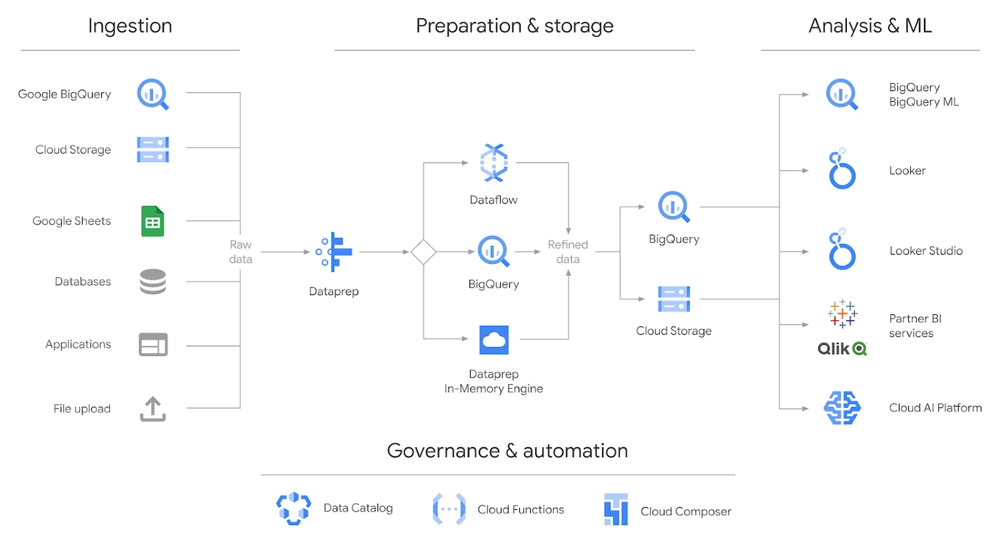

# Dataprep

## Introduction

Dataprep by Trifacta is a user-friendly data preparation tool that simplifies the process of cleaning, transforming, and enriching raw data. It provides a visual interface where users can interactively explore and shape their data without the need for complex coding or scripting. Dataprep automatically detects patterns, anomalies, and inconsistencies in the data, and suggests transformations and cleaning actions to improve data quality.



<figure><figcaption></figcaption></figure>


