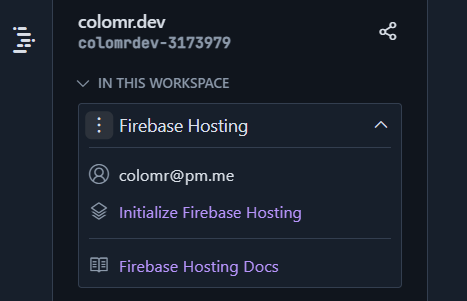

# Workspace IDX



## Workspace: colomr.dev

Si al lanzar el workspace no tenemos node instalado en el terminal sólo podemos hacerlo mediante un paquete `dev.nix` así:

```nix
# Use https://search.nixos.org/packages to find packages
  packages = [
    pkgs.nodejs_18
  ];
```

Veo que no lo tengo como paqueta .nix pero si está instalado al comprobar con el terminal:

```bash
colomrdev-3173979:~/colomr.dev{main}$ node --version
v20.11.1
```

Por tanto sólo tenemos que actualizarlo a la versión que queramos con el propio gestor de paquetes de node.

### Entorno dev.nix



````nix
```nix
 # Use https://search.nixos.org/packages to find packages
  packages = [
    pkgs.hugo
  ];
```
````

### Installamos Firebase CLI con node&#x20;

```
npm install firebase
```

### Integración IDX -> Firebase

Desde la barrar lateral IDX > **Firebase Hosting** &#x20;

<figure><figcaption></figcaption></figure>

### Prevista web de hugo server

Para la vista de desarrollo de hugo server, en localhost nos suele abrir un socket en el puerto `:1313` en este caso no podemos porque tenemos el IDE y el entorno en Cloud. Lo cual se soluciona también desde `dev.nix` después de varias pruebas he encontrado esta configuración óptima (sin errores):

````nix
```nix
# Enable previews and customize configuration
  idx.previews = {
    enable = true;
    previews = {
      web = {
        command = [
          "hugo"
          "server"
          "--"
          "--port"
          "$PORT"
          "--host"
          "0.0.0.0"
          "--disable-host-check"
        ];
        manager = "web";
      };
    };
```
````

Cuando queremos ver una vista en desarrollo, como siempre llamamos a `hugo server` para generar los estáticos en públic y genera un enlace para la vista web en el terminal. El enlace lo vemos en el propio terminal, situándonos encima de esta dirección&#x20;

<figure><figcaption></figcaption></figure>

### Integración con Github

Funciona pero me pide un token de aplicación cada vez que hago un `push` al repo. Tengo que dedicar tiempo para que la integración evite ese paso siempre que la sesión de Github esté abierta desde el mismo navegador.  -> <mark style="color:yellow;">Por Hacer</mark>
