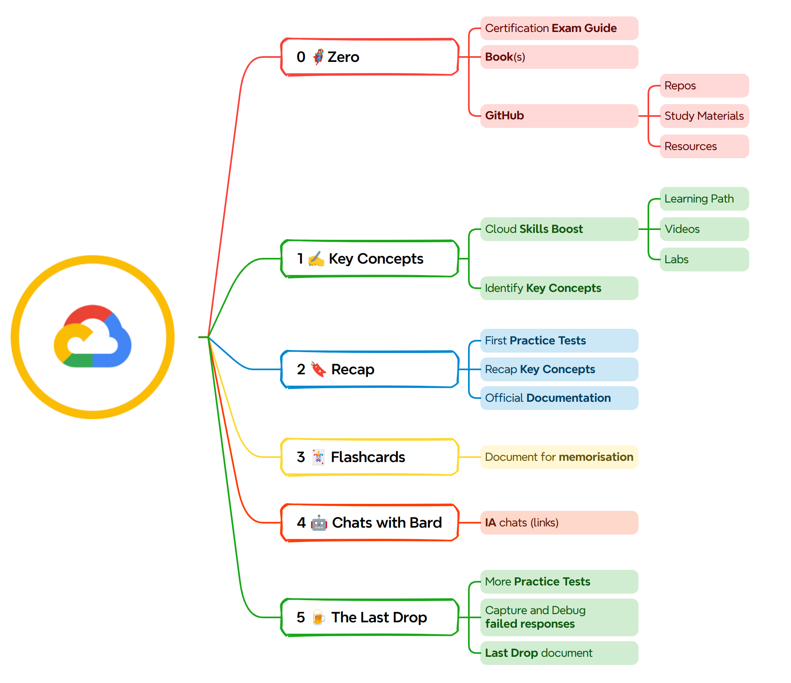

# 🔰 Personal Study Method

<figure><figcaption>
sequential representation (Gantt)
</figcaption></figure>

## From Zero to Hero 🦸‍♂️

This is a previous stage where I usually do a research on what the certification exam will cover. A good starting points to do so are:

* Read the official **Certification Exam Guide** (CEG) carefully
* Read the **most up-to-date book** on the certification to prepare
* Explore **GitHub repositories** to find study **materials** and other **resources**

After completing these steps we'll get a high-level overview of the main topics for the exam.

## Key Concepts ✍

Once we identified the main exam topics, it's time to get to work taking the corresponding _Learning Path_ in [**Cloud Skills Boost**](https://www.cloudskillsboost.google/). I suggest not missing any lab on this.

And just when the Learning Path is done, we're in a good point to write down the documento "**1 · XXX Key Concepts**", this document is an index (with links) with the main concepts to master for the exam.

## Recap 🔖

It's time to start doing the firsts **exams practice tests**&#x20;



By taking 5-10 tests, we may understand how short (or far) we are from the **passing score** (around 80%). In this first tests I usually fall into 65-75 % of correct answers, so...&#x20;

<figure><figcaption>
Too much to learn I still have
</figcaption></figure>

Exams practice is process that helps to:

* outline key concepts
* improve concentration&#x20;
* reading comprehension

Time to write the document "**2 · XXX Recap**" with better a perspective: at this point we must understand what is, and what is not, important for the "real" exam.&#x20;

## Flashcards 🃏

Unfortunately, on the exam there are responses that have to be learned by heart. This is a bit stupid and our memory tends to become released in the days following the exam; for this we have "flashcards", a kind of memorisation technique.

Let's write "**3 · XXX Flashcards**" to this values we need to memorise.&#x20;

## Chats with Bard 🤖

Of course! AI is also part of my learning process. It is useful chat with Bard to clarify certain concepts with natural language rather that seeking information by search engines. &#x20;


Bard is not always right. It is your responsibility to verify all information in case of doubts.


It is a good practice to index all the chats in "**4 · XXX Chats with Bard**" for later review.

## The Last Drop 🍺

At this point the exam is **already scheduled** and we are a few days early; we notice that we are a little nervous while studying, just as a Scotsman would be when he hears that it is time for "The Last Drop."

These lasts days we MUST do the following:

* Intensify the number of practice tests per day
* Identify concepts still weak&#x20;
* Index weak points in "5 · XXX The Last Drop" document
* Review all notes, documents, chats and oficial documentation&#x20;

Good Luck!
