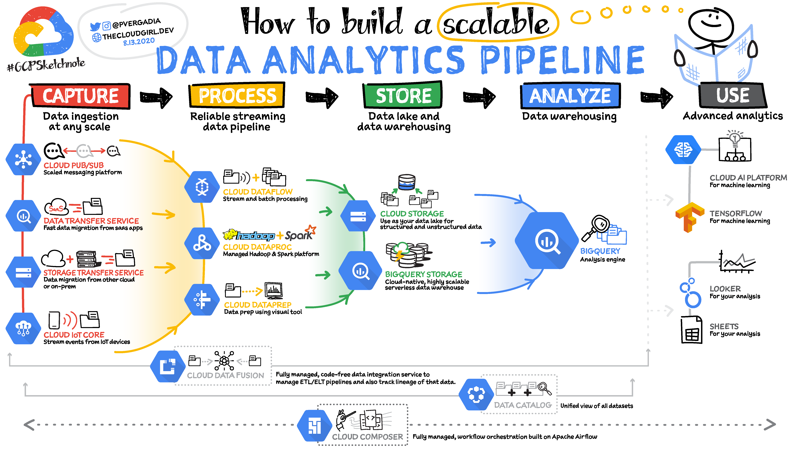

# Data Analytics Pipeline

<figure><figcaption></figcaption></figure>

The GCP product grid for data analysis is confusing for newbies. We have to consider them from their corresponding phase (capture, process, store, analyse and use). knowing what they were designed for and what a product offers us compared to another with similar characteristics.
