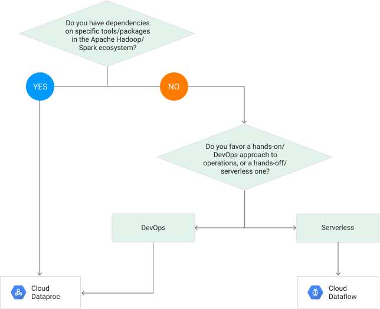

# Products Comparison

## Cloud Dataproc vs Cloud Dataflow

Here are three main points to consider while trying to choose between Dataproc and Dataflow

* **Provisioning**\
  Dataproc - Manual provisioning of clusters\
  Dataflow - Serverless. Automatic provisioning of clusters
* **Hadoop Dependencies**\
  Dataproc should be used if the processing has any dependencies to tools in the Hadoop ecosystem.
* **Portability**\
  Dataflow/Beam provides a clear separation between processing logic and the underlying execution engine. This helps with portability across different execution engines that support the Beam runtime, i.e. the same pipeline code can run seamlessly on either Dataflow, Spark or Flink.

This flowchart from the google website explains how to go about choosing one over the other.

<figure><figcaption></figcaption></figure>

More info on this link\
[https://stackoverflow.com/questions/46436794/what-is-the-difference-between-google-cloud-dataflow-and-google-cloud-dataproc](https://stackoverflow.com/questions/46436794/what-is-the-difference-between-google-cloud-dataflow-and-google-cloud-dataproc)&#x20;
